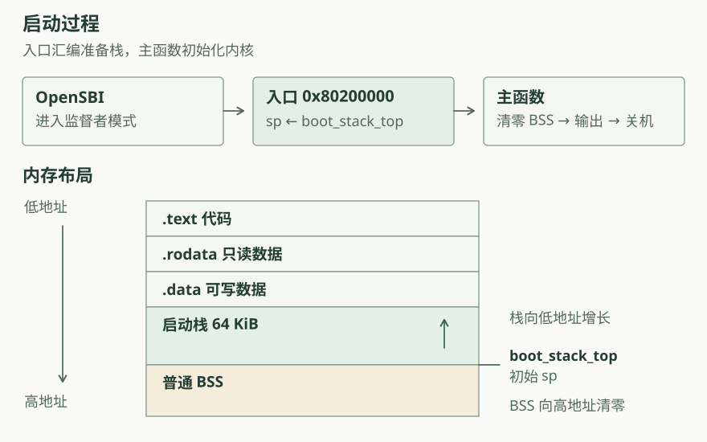

# 启动与基本执行环境

在已有操作系统上运行程序时，装载器和运行库会准备内存、栈以及输入输出接口。本章的程序直接运行在 QEMU 模拟的 RISC-V 机器上。这些准备工作由启动固件、入口汇编和内核代码共同完成。

## 从固件进入内核

本章使用 QEMU `virt` 机器及其 OpenSBI 固件。固件完成机器级初始化后，将执行权交给位于 `0x80200000` 的内核。内核入口处在监督者模式，后续通过 SBI 调用使用固件提供的服务。

两套实现都把入口汇编放在 `.text.entry`，链接脚本将它排在代码段的开头。入口先把 `sp` 设为启动栈顶，再调用 Rust 或 C 的主函数。顺序很重要：编译器生成的函数可能立即调整栈指针、保存寄存器或存放局部变量。

## 链接地址与内存初始状态

链接脚本决定代码和数据在内存中的位置，并生成供程序引用的边界符号。

| 区域 | 内容 | 初始化方式 |
| --- | --- | --- |
| `.text` | 入口和函数指令 | 随内核映像装载 |
| `.rodata` | 字符串等只读常量 | 随内核映像装载 |
| `.data` | 具有非零初值的可写全局数据 | 随内核映像装载 |
| 普通 BSS（不含启动栈） | 零初始化的静态存储 | 本章入口代码显式清零 |
| 启动栈 | 函数调用使用的存储 | 入口汇编预留空间并设置 `sp` |

两套链接脚本都把启动栈的 `.bss.stack` 放在普通 BSS 之前。清零起点位于栈顶之后，清零过程不会覆盖当前正在使用的调用栈。区间采用左闭右开的表示法：起点属于区间，终点不属于区间。

ELF 保存段、符号和调试信息；裸二进制保存装载所需的字节。NodeFusion 根据 ELF 中的符号和调试信息，将运行中的指令地址关联到函数和源码。

## 从函数调用到字符输出

RISC-V 调用约定使用 `ra` 保存返回地址，`sp` 指向当前栈，`a0` 等寄存器传递参数。入口的 `call` 与后续函数调用遵循同一约定。栈向低地址增长，栈顶是预留区域的高地址边界。

两套控制台都将格式化后的字符传给 SBI 输出接口。在本章，内核执行 `ecall` 向机器模式固件请求服务。第二章中用户程序执行 `ecall` 时，则由监督者模式内核处理系统调用。

日志级别决定哪些消息输出，低于配置级别的日志会被过滤。

## 沿运行记录检查启动

按以下顺序比较源码、链接结果和运行记录：

1. 在入口汇编中找到设置 `sp` 和调用主函数的指令。
2. 从 ELF 读取入口、启动栈与 BSS 的边界。
3. 检查主函数入口记录中的 `sp` 是否等于启动栈顶。
4. 查看清零函数的入口及其清零区间。
5. 沿控制台输出与终止路径查看调用关系。

在 [rCore 实现](rcore.md)和 [uCore 实现](ucore.md)中，可以对照入口、栈和 BSS 边界。关于目标平台、调用约定和 SBI，可继续阅读 [rCore 教程第一章](https://rcore-os.cn/rCore-Tutorial-Book-v3/chapter1/index.html)。
