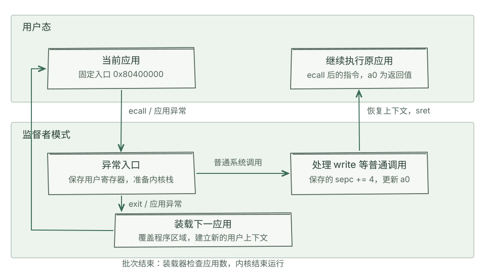

# 第二章：批处理与系统调用

一个应用输出结果后退出，内核接着装载下一个应用。若应用执行了非法指令，内核也需要取得控制权，结束该应用并继续批次。

本章把应用放在用户态执行，将装载、输出和退出交给监督者模式的内核。应用执行 `ecall` 请求服务；异常入口保存应用的寄存器，内核处理请求后恢复这些寄存器，再从用户程序的继续执行位置运行。

## 从一个程序到一批应用

第一章的内核已经能够使用栈、输出字符和结束运行。第二章在内核映像中加入用户应用的二进制及其位置表。装载器根据表中相邻的两个地址找到应用，将它复制到固定执行地址 `0x80400000`。

同一时刻只有一个应用执行。退出或发生本章处理的异常后，下一应用覆盖这一执行区域，再使用重新建立的用户上下文启动。第三章将保留多个应用的代码和执行状态，使它们能够暂停后继续运行。

图中的普通系统调用沿右侧路径返回原应用；退出和应用异常沿下方路径装载下一应用。两条路径对上下文的处理不同：前者保留当前寄存器，后者建立新应用的初始寄存器。

## 硬件入口与软件保存

用户态执行 `ecall` 后，处理器记录异常指令地址与原因，切换到监督者模式，并跳转到 `stvec` 指定的入口。入口汇编再保存通用寄存器，准备内核栈，调用 Rust 或 C 的处理函数。

| 状态 | 用途 |
| --- | --- |
| `sepc` | 异常指令地址，也是 `sret` 的跳转目标 |
| `scause` | 区分用户系统调用、非法指令等原因 |
| `stval` | 为相应异常提供地址或指令信息 |
| `sstatus.SPP` | 指定异常返回后的特权级 |
| `sscratch` | 供入口汇编交换用户寄存器或取得上下文地址 |

处理器不会自动把全部通用寄存器压入内存，也不会替软件准备内核调用栈。寄存器保存区与栈必须有足够空间，并在处理请求期间保持有效。两套实现分别把用户上下文放在内核栈顶和独立的 `trap_page` 中。

本章使用裸地址运行，`satp` 为零。特权级限制了用户程序可执行的指令，内核与应用之间的普通内存访问权限还没有通过独立页表划分。第四章将加入地址转换与页级权限。

## 一次 write 如何返回

用户程序把系统调用号 64 放入 `a7`，将文件描述符、缓冲区地址和长度放入 `a0`、`a1`、`a2`，再执行 `ecall`。异常入口保存的寄存器就是内核分发请求的依据。

内核将保存的 `sepc` 增加 4，调用写接口，把返回值写回保存的 `a0`。异常返回恢复通用寄存器和控制状态，执行 `sret`。用户程序继续执行 `ecall` 后面的指令，并在 `a0` 中取得结果。这里的 4 对应 `ecall` 的指令长度。

系统调用使用的地址来自用户寄存器。文件描述符检查、地址范围检查与字符编码检查是三个不同问题，两套参考实现对它们的处理可在[实现比较与练习](exercises.md)中对照。

## 退出与应用异常

系统调用 93 表示退出。退出路径装载下一应用，为它建立入口地址、用户栈指针和用户态返回状态。原应用的退出调用不会返回。

访问异常与非法指令也会使执行流离开用户程序。内核依据异常原因决定处理方式。两套参考实现的具体分支不同，阅读时可以沿 [rCore 的异常分发](rcore.md#退出与应用异常)和 [uCore 的异常分发](ucore.md#退出与应用异常)查看。

## 沿运行记录检查上下文

先选择一条用户系统调用，再按以下顺序查看相邻事件：

1. 在 `ecall` 记录中读取 `a7`、参数及 `sepc`。
2. 查看异常处理函数的入口参数和 `sp`，确定用户上下文与内核栈的位置。
3. 在返回前的上下文中检查 `sepc` 和 `a0`。
4. 对退出路径查看下一应用的装载与初始上下文。

正文中的累计指令数从虚拟机启动开始计算。每套实现都提供本次录制的报告、串口日志和构建参数。关于特权级和异常上下文，可继续阅读 [rCore 教程第二章](https://rcore-os.cn/rCore-Tutorial-Book-v3/chapter2/index.html)。
