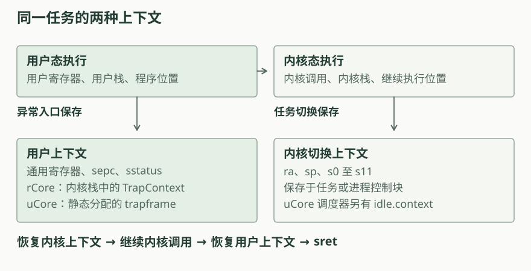
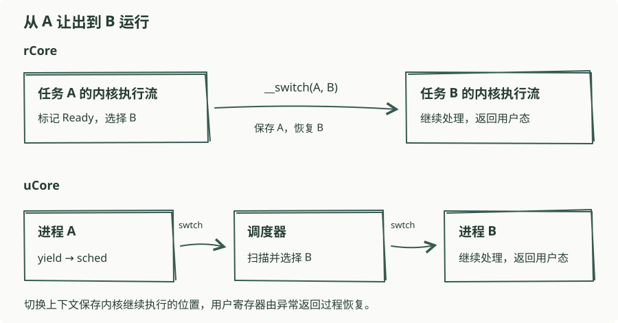

# 第三章：任务切换与调度

设两个程序分别输出字符 A 和 B。一个程序输出后主动让出处理器，另一个程序随后执行。下一次轮到第一个程序时，它需要继续原来的循环，保留循环变量和函数调用的进度。

操作系统为每个程序保存执行状态，并在程序之间分配处理器。本章分析上下文切换和调度过程。

## 本章在内核中的位置

第二章已经建立用户程序进入内核、处理请求和返回用户态的路径。第三章在这条路径中加入任务切换：处理系统调用或时钟中断时，当前程序可以暂停，内核转而恢复另一个程序。程序的代码与静态栈空间在启动时准备好，页表与独立地址空间将在第四章讨论。

## 保存哪些状态

程序进入内核时，异常入口保存用户寄存器和返回地址。这些信息用于恢复用户态执行，rCore 将其放在 `TrapContext` 中，uCore 将其放在 `trapframe` 中。

处理请求的内核代码也会调用函数并使用栈。切换到另一个任务之前，还需要保存当前内核调用的继续执行位置。两套实现的切换上下文都包含 `ra`、`sp` 和 `s0`—`s11`。其他寄存器由调用约定以及异常入口的保存过程共同处理。

图中左侧表示程序进入内核时保存的用户状态；右侧表示内核暂停这条执行流时保存的切换状态。恢复内核上下文后，内核先完成原有处理过程，再通过异常返回恢复用户程序。

上下文切换汇编最后执行 `ret`。此时 `ra` 已从目标上下文恢复，`ret` 跳转到目标任务的继续执行位置；`sp` 也指向目标任务的内核栈。一个切换调用可以隔着其他任务的执行，稍后才返回。

## 任务状态与调度资格

一个准备运行的任务处于就绪状态。被选中后进入运行状态。主动让出或被时钟抢占时，它重新进入就绪状态，等待后续调度。退出后则失去运行资格。

两套内核使用不同的枚举名称：

| 含义 | rCore | uCore |
| --- | --- | --- |
| 未使用 | `UnInit` | `UNUSED` |
| 已分配，尚未加载完成 | 初始化过程内完成 | `USED` |
| 就绪 | `Ready` | `RUNNABLE` |
| 运行 | `Running` | `RUNNING` |
| 已退出 | `Exited` | 本章恢复为 `UNUSED` |

uCore 的枚举还包含 `SLEEPING` 和 `ZOMBIE`，第三章的这些路径没有使用它们。两套实现都在切换前更新调度状态，随后保存与恢复寄存器。

## 主动让出与时钟抢占

主动让出从用户程序的系统调用开始。内核保存用户上下文，分发让出请求，将当前任务设为就绪，再执行调度。时钟抢占由中断触发，内核设置下一次定时器，然后进入同一调度接口。

这两条路径可以通过异常原因区分。`yield` 或 `suspend_current_and_run_next` 的入口次数同时包含两种原因；分析一次切换时，需要查看此前的系统调用或时钟中断。

## 两种切换路径

rCore 在当前任务的内核执行流中选择下一个任务，然后直接切换。uCore 先保存当前进程的内核上下文，恢复调度器上下文；调度器继续扫描进程表，再切换到选中的进程。

[逐步查看切换过程](../diagrams/ch3-switch.html)。交互图使用两个任务的教学示例，可分别查看主动让出、时钟抢占、退出和只剩一个任务时的状态变化。实际运行数据见两套实现的运行观察部分。

## 切换时需要保持的条件

- 目标任务已就绪，其上下文和栈存储仍然有效。
- 恢复用户态执行时，当前任务标识与实际程序一致。
- 暂停任务保留原有上下文，退出任务不再被选中。
- rCore 在调用 `__switch` 前释放任务管理器的动态借用，使其他任务能够访问管理状态。

[rCore 的任务管理器](rcore.md)直接选择并切换任务；[uCore 的调度循环](ucore.md)先返回调度器，再选择下一进程。
