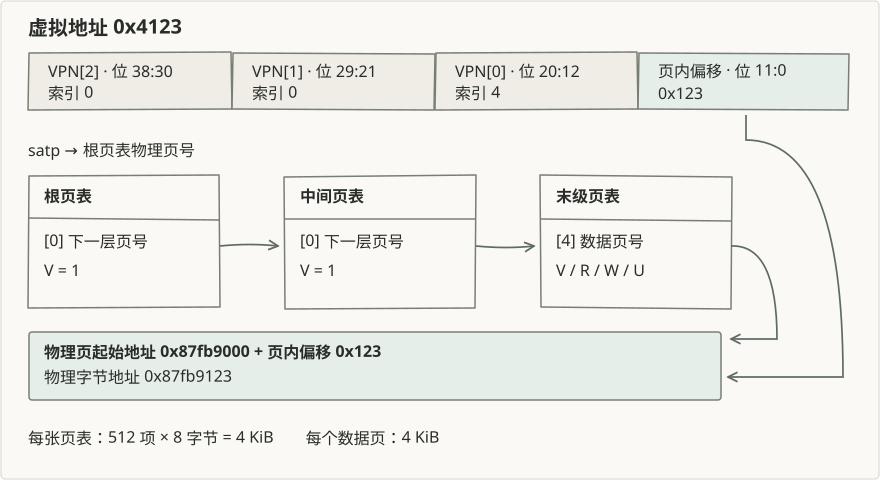

# 第四章：地址空间与页表

两个程序都访问 `0x4000`，读到的内容可以不同。处理器使用当前页表，将这个虚拟地址转换成各自的物理地址。程序能够访问哪些页、能否修改或执行其中的内容，也由页表项中的权限位决定。

第三章保存和恢复程序的执行状态。本章进一步为每个程序建立地址空间，使切换后的程序在自己的内存中继续执行。

## 地址空间在内核中的位置

任务控制块关联用户页表、用户栈和异常上下文。异常入口在用户页表下保存寄存器，随后切换到内核页表。返回用户态时，内核选择当前任务的页表，恢复寄存器并执行 `sret`。

一次完整访问涉及三类对象：虚拟地址范围说明内存的用途，页表建立虚拟页到物理页的对应关系，物理页分配器提供实际存储。撤销页表项和归还物理页分别改变后两类对象。

## Sv39 地址转换

本章两套实现都使用三级页表和 4 KiB 页。虚拟地址的低 12 位是页内偏移，三个 9 位字段依次索引根页表、中间页表和末级页表。每张页表占一个物理页，包含 512 个 8 字节页表项。

以 `0x4123` 为例，三级索引为 `0、0、4`，页内偏移为 `0x123`。末级页表项若指向物理页 `0x87fb9000`，转换结果为 `0x87fb9123`。这个对应关系来自 uCore 的独立页表实验。

`satp` 保存地址转换模式与根页表物理页号。写入新的 `satp` 后，两套异常返回汇编执行 `sfence.vma`，使后续访问按新的页表转换。

## 页表项与访问权限

| 位 | 含义 | 本章用途 |
| --- | --- | --- |
| `V` | 有效 | 区分页表项是否存在 |
| `R`、`W`、`X` | 读、写、执行 | 约束对末级映射的访问 |
| `U` | 用户态可访问 | 区分用户页与内核专用页 |
| `A`、`D` | 已访问、已修改 | 由地址转换机制检查或更新 |

中间页表项设置 `V`，指向下一层页表。末级映射还包含访问权限和目标物理页号。创建映射时需要防止覆盖已有映射；查找地址时则无需分配新的页表页。

Sv39 的有效虚拟地址要求第 63 至 39 位与第 38 位相同。rCore 的地址类型按这一规则处理高地址；uCore 本章的 `walk` 将地址限制在 `MAXVA` 以下。

## 用户页表与内核页表

用户程序进入异常处理时，处理器已经切换到 S 模式，页表仍然属于用户程序。异常入口必须先在这张页表中执行，保存用户寄存器，再切换到内核地址空间。

两套内核将跳板代码映射到用户页表与内核页表中的同一个虚拟地址。切换 `satp` 后，下一条指令仍然能从这个地址取到。异常上下文页设置读写权限而不设置 `U`，供 S 模式入口保存寄存器；用户程序无法直接访问它。

内核页表还包含内核代码、数据和可用物理内存的恒等映射。内核将用户虚拟地址转换为物理地址后，可以通过这些映射访问用户缓冲区。

## 建立与撤销映射

建立映射时，内核取得数据页和必要的页表页，再设置页表项。撤销映射后，是否归还数据页取决于该页的所有权。同一物理页可以被多张页表使用，归还前需要确保原有访问都已结束；本章的共享跳板就在各用户页表中保留同一个物理页。

页表本身也占用物理页。撤销一个末级映射通常保留中间页表，完整销毁地址空间时才逐层释放这些结构。数据页的归属与页表页的归属需要分别管理。

[rCore 实现](rcore.md)按内存区域组织这些关系；[uCore 实现](ucore.md)使用页表函数和显式释放参数。两套源码的具体权限检查、装载方式和回收路径见各自小节。
