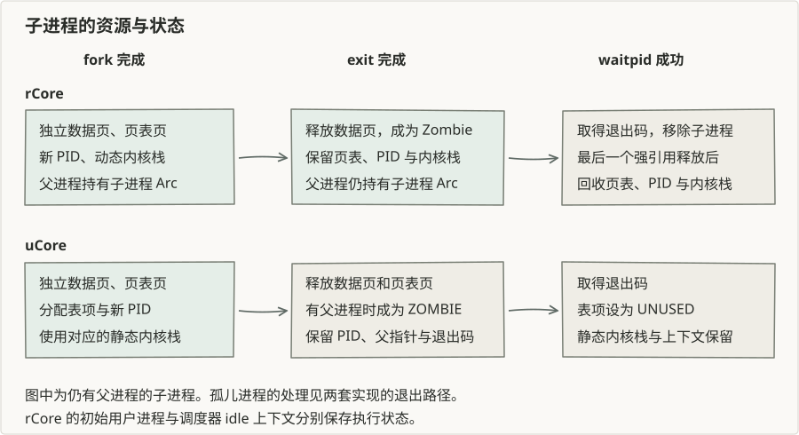

# 第五章：进程创建与回收

一个用户程序执行 `fork` 后，父进程和子进程都从这次系统调用之后继续运行。父进程得到子进程的 PID，子进程得到零。两者最初拥有相同的用户寄存器和内存内容，随后可以分别修改自己的数据、执行不同程序。

第四章建立独立地址空间。本章将地址空间、执行状态和进程关系结合起来，使用户程序能够在运行期间创建和回收进程。

## 进程的执行环境

进程控制块保存 PID、状态、地址空间、用户寄存器、内核执行上下文以及父子关系。调度器从就绪进程中选择下一次运行的对象。进程进入系统调用后使用自己的内核栈；暂停时，任务上下文记录内核执行位置，异常上下文保留用户执行位置。

阅读本章需要熟悉第三章的上下文切换，以及第四章中数据页、页表页与异常上下文页的用途。分析一次进程操作时，可以分别检查执行位置、内存所有权和父子关系的变化。

## fork 的两次返回

异常处理器先将保存的用户 PC 移到 `ecall` 的下一条指令，再处理系统调用。`fork` 复制这个异常上下文，因此子进程首次返回用户态时也从下一条指令执行。内核将子进程保存的 `a0` 设为零，并向父进程返回子进程 PID。

两套参考实现都为子进程分配独立的数据页，将父进程的内容复制过去。复制后，同一个用户虚拟地址在两张页表中指向不同物理页。共享跳板继续使用原有物理页。

子进程还需要自己的内核栈和初始任务上下文。两个进程分别保存内核执行状态。

## exec 装载新程序

`exec` 在现有进程中装载目标程序，重新设置入口地址和用户栈。PID 和父子关系保持不变，接下来的异常返回进入新程序。

本章的程序保存在内核镜像中，装载器按名字查找。shell 可以先 `fork` 创建子进程，让子进程 `exec` 目标程序，自己等待子进程结束。这样，目标程序退出后，shell 的地址空间和执行位置仍然保留。

rCore 本章还提供 `spawn`，直接用目标 ELF 建立子进程。它与 `fork` 后 `exec` 的资源分配顺序不同，具体实现见 [rCore 分析](rcore.md#exec-与程序装载)。

## 退出与等待

进程退出后，调度器不再选择它。退出状态仍需交给父进程，因此内核保留 PID、退出码和父子关系，供 `waitpid` 查询。

资源在退出和等待两个阶段分别变化。rCore 先释放用户数据页，父进程等待成功时再释放子进程控制块、页表页、PID 和内核栈。uCore 在退出时释放用户数据页和页表页，等待成功后将进程表项恢复为 `UNUSED`；它的内核栈和异常上下文使用静态数组。

僵尸状态保存的是已经结束的进程信息。父进程先退出时，两套实现处理子进程的方式也不同：rCore 将子进程交给初始进程，uCore 清空子进程的父指针，并清理已经退出的子进程表项。

## 调度与进程关系

创建进程只建立执行环境，加入就绪队列后才可能获得处理器。进程主动让出或被时钟抢占时，内核保存任务上下文，回到调度器，再选择就绪进程。

本章 rCore 使用 stride 调度，根据优先级计算每次选择后的增量；uCore 使用先进先出的就绪队列。等待子进程的路径也不同：rCore 的用户库在子进程尚未退出时让出并重试，uCore 在内核的 `wait` 循环中重新入队并切换。

沿一次 `fork`、`exec`、`exit` 和 `waitpid`，可以在 [rCore 实现](rcore.md)与 [uCore 实现](ucore.md)中对照进程的建立、调度和回收。进程接口的概念说明还可参考 [rCore 教程第五章](https://rcore-os.cn/rCore-Tutorial-Book-v3/chapter5/1process.html)。
