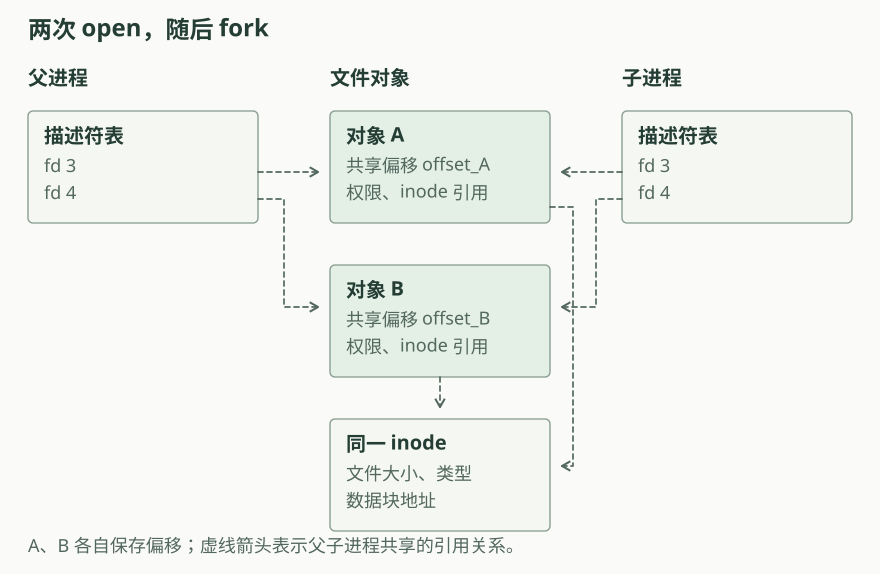

# 第六章：文件系统

前一章的装载器从内核镜像中取出用户程序。本章把程序和普通文件放到磁盘上，内核通过文件系统按名字查找、读取和修改它们。文件系统把文件的字节偏移转换成磁盘块号，并在内存中缓存经常访问的块。

## 文件名与文件描述符

应用先用文件名打开文件，得到一个整数文件描述符。后续 `read`、`write` 和 `close` 使用这个描述符。内核在进程的描述符表中查到文件对象，再通过索引节点访问文件内容。

文件对象保存这次打开的读写位置。两次独立的 `open` 得到两个文件对象，各自从文件开头读写；`fork` 复制已有对象的引用，父子进程因而共享读写位置。索引节点保存文件大小与数据块地址，同一个文件的不同打开对象都访问它。

关闭一个描述符会释放它持有的文件对象引用。目录项保存文件名到索引节点编号的对应关系。rCore 删除文件名时修改目录项；关闭描述符则释放进程持有的引用。

## 从字节到磁盘块

设文件系统块大小为 `B`，文件偏移为 `offset`。`offset / B` 给出文件内的逻辑块号，`offset % B` 给出块内偏移。索引节点中的直接地址或间接索引把这个逻辑块号转换成磁盘块号。

直接地址足够保存小文件。文件增长到直接地址容量以外时，需要额外的索引块，保存更多数据块地址。索引块自身也占用磁盘空间；截断文件时，内核需要回收数据块和索引块。

[打开偏移计算图](../diagrams/ch6-blocks.html)。输入文件偏移，查看需要访问的直接地址或间接块地址项；两套布局可以在图中直接切换。

用户缓冲区还可能跨越页边界。文件内容按磁盘块读取，用户地址按页表映射复制；两种边界可以落在请求的不同位置。

## 缓存与设备请求

目录查找、读取文件和分配磁盘空间都需要访问磁盘块。块缓存按磁盘块号保存内容。命中已有缓存时，内核直接访问内存；没有相应缓存时，块设备驱动发出读取请求。

写操作还涉及内存与磁盘内容的一致性。rCore 的缓存记录脏标志，由同步操作或缓存析构写回。uCore 的文件系统在修改块之后显式调用 `bwrite`。两套实现都直接更新数据、索引节点与分配位图，没有日志事务层。

块设备通过 VirtIO 与 QEMU 中的磁盘交互。rCore 的本章驱动轮询请求完成状态；uCore 发布请求后等待设备中断更新完成标志。沿一次读写，可以分别找到文件操作、缓存访问和实际设备请求。

## 文件系统与进程

`exec` 通过文件系统取得目标程序，再建立新的用户执行环境。原进程的 PID、父子关系和文件描述符保留。进程退出时关闭描述符，释放文件对象引用。

文件的内容格式由使用它的程序解释。rCore 的装载器读取 ELF 并按段建立映射；uCore 的装载器读取平坦二进制文件，按固定起始地址装入用户内存。两者在文件系统中都以普通文件保存程序。

## 源码阅读

从系统调用入口开始，先找到描述符如何选中一个文件对象，以及偏移在哪里更新。随后查看目录查找、逻辑块到磁盘块的转换、块缓存和设备驱动。最后回到 `fork`、`exec` 与退出路径，检查描述符表中的引用如何保留或释放。

[rCore 实现](rcore.md)和 [uCore 实现](ucore.md)分别说明文件对象、块索引与缓存。文件接口的概念还可参考 [rCore 教程的文件系统接口](https://rcore-os.cn/rCore-Tutorial-Book-v3/chapter6/1fs-interface.html)。
