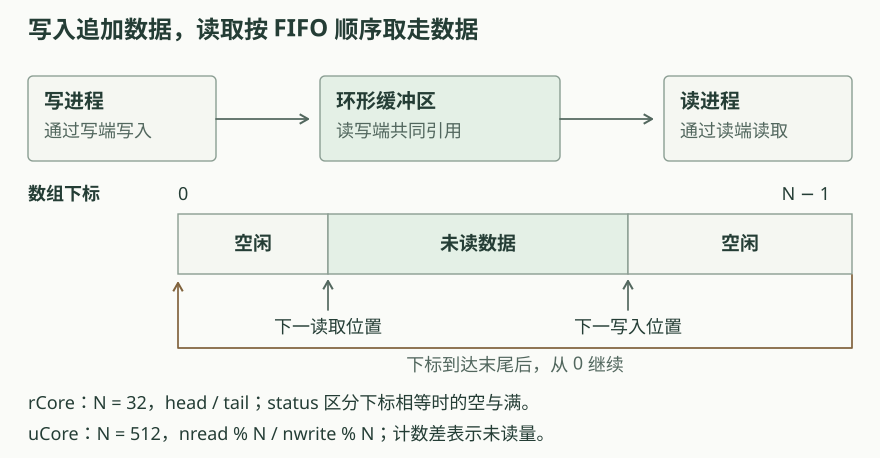

# 第七章：进程间通信

上一章用文件描述符访问磁盘文件。本章沿用这个接口，在内存中建立管道，让一个进程写入的字节被另一个进程读到。管道把进程之间的数据传递、调度和资源释放联系起来。

## 父子进程共享管道

`pipe` 创建一个读端和一个写端，把两个描述符交给调用者。两端连接同一个缓冲区。应用通过写端把字节放到队尾，通过读端取走队首字节，按 FIFO 顺序传递数据。

父进程先创建管道，再调用 `fork`。子进程继承描述符表中的引用，因而可以访问同一管道。若父进程负责写、子进程负责读，父进程关闭自己的读端，子进程关闭自己的写端；双方只保留后续使用的端点。

一个管道传递一个方向的数据。双向通信需要两个管道，分别连接两个方向的写端与读端。rCore 的大管道用例先由父进程发送 3000 字节，再由子进程通过另一管道送回校验结果。

## 读写和缓冲区

缓冲区大小固定，读取和写入分别推进数组中的位置。位置到达末尾后从零继续，形成环形缓冲区。rCore 的容量为 32 字节，uCore 的容量为 512 字节。

一次请求可以超过缓冲区容量。写进程填满缓冲区后，需要让读进程取走一部分数据，再继续写入。读进程遇到空缓冲区时，也需要等写进程产生数据。本章两套实现通过主动让出处理器并重查条件完成等待，进程仍保留在可调度状态。

读取返回的时机由具体实现决定。rCore 尽量读满请求长度，写端全部关闭后才允许不足长度的返回。uCore 等到至少有数据之后，读取当前可用字节并返回，应用需要循环处理短读。

[打开管道交互图](../diagrams/ch7-pipe.html)。选择“超过缓冲区容量”，交替运行写进程与读进程，查看请求进度、数组下标和缓冲区占用。再选择“短读与等待”，比较两个读取函数何时返回。

## 关闭与通信结束

关闭描述符释放它持有的文件对象引用。`fork` 后，父子进程可能分别持有同一端点；rCore 的 `dup` 也会增加引用。只有所有写端引用都释放，读进程才能判断后续不会再有数据。

写端关闭时，缓冲区可能还留有未读字节。读进程先取走这些字节，再处理空缓冲区上的结束条件。两端均释放后，内核回收共享缓冲区。rCore 在读空且写端全部关闭时返回已读长度，uCore 在空管道上返回 `-1`。

描述符的生命周期会影响程序能否结束。例如子进程忘记关闭自己继承的写端，即使父进程已经关闭写端，子进程仍可能等待自己不会再写入的数据。[实现比较与练习](exercises.md)从这个例子推演引用与等待条件。

## 源码阅读

先沿 `sys_pipe` 找到端点、缓冲区和描述符的创建顺序，再阅读缓冲区中的下标更新与读写循环。随后追踪 `fork`、`close` 和退出路径，检查端点最后由谁释放。用户缓冲区的页表转换继续使用第四章的地址空间机制。

[rCore 实现](rcore.md)还分析 `dup`、shell 重定向和信号处理；[uCore 实现](ucore.md)结合独立边界实验，分析跨页复制、短读与描述符分配失败后的回滚。管道接口的基本使用也可参考 [rCore 教程的管道一节](https://rcore-os.cn/rCore-Tutorial-Book-v3/chapter7/2pipe.html)。
