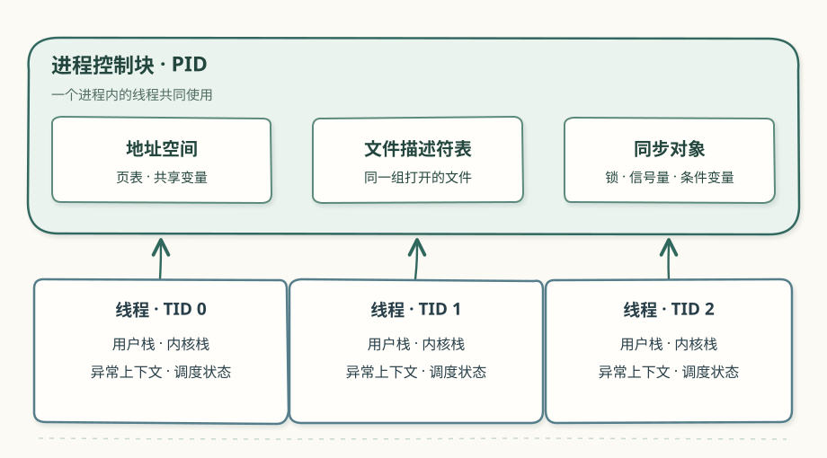

# 第八章：线程与同步

第五章的进程各有地址空间。一个进程也可以包含多个线程：它们使用同一地址空间和文件描述符表，各自保存执行位置、栈和调度状态。第七章用管道传递数据；本章的线程可以直接访问同一变量，因而需要约定谁可以在什么时候修改它。

## 共享资源与线程状态

两个线程同时执行 `counter = counter + 1`，可能都先读到旧值，最后只留下其中一次写入。互斥锁把读取、计算、写回放在同一临界区。信号量用于限制并发访问数量，也能表示一次事件是否已经发生。条件变量让线程等待共享条件发生变化。

线程进入内核后仍属于原进程。进程控制块管理地址空间、文件与同步对象；线程控制块保存自己的上下文和栈。线程局部编号 TID 与进程编号 PID 需要一起看，同一个 TID 可以出现在不同进程中。

## 创建与回收

`thread_create` 指定新线程的入口函数与参数。内核分配线程标识和执行资源，设置新线程的用户态入口与栈，再将它放入就绪队列。新线程与创建者执行的先后顺序取决于调度。

线程退出后，`waittid` 取得退出结果并完成余下的回收。两个实现对 TID 的复用时机、线程槽位和错误参数有不同安排。[rCore 实现](rcore.md#创建退出与等待)与 [uCore 实现](ucore.md#创建退出与等待)沿创建、退出、等待三条路径逐项追踪资源。

## 等待与唤醒

自旋互斥锁遇到竞争时让出处理器，下一次运行再检查锁。阻塞互斥锁把当前线程放入等待队列，直到解锁方将它唤醒。解锁时，如果队列中已有等待者，锁直接交给队首线程；若无人等待，锁才变为空闲。

条件变量的 `signal` 唤醒一个等待者。等待者恢复运行后仍需重新获得互斥锁，才从 `wait` 返回。通知者在发出通知时可能还持有锁，所以“已唤醒”和“已进入临界区”是两个不同的时刻。

[打开锁与条件变量交互图](../diagrams/ch8-sync.html)。逐步执行两个线程，观察等待队列、锁持有者和就绪状态如何变化。

## 源码阅读

先看线程控制块与进程控制块的引用关系，再沿 `thread_create`、调度入口、退出和 `waittid` 找到资源的分配与回收位置。随后用互斥锁的等待队列解释一次竞争，继续追踪条件变量等待函数释放锁、阻塞、重新加锁的顺序。

两套参考实现都提供自旋锁、阻塞锁、信号量和条件变量。rCore 还实现了资源分配检查。两者的结构与运行过程分别见 [rCore 实现](rcore.md)和 [uCore 实现](ucore.md)。
